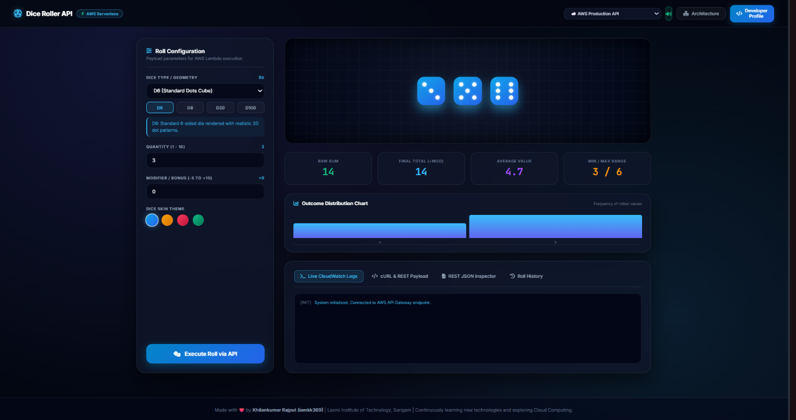

# Dice Roller API

A serverless dice-rolling API built with AWS Lambda, Amazon API Gateway, and AWS SAM, accompanied by a browser-based dashboard. The API returns random rolls for a configurable die and quantity; the dashboard adds dice visuals, statistics, modifiers, local history, and CSV export.

- **Developer:** Khilankumar Rajput
**Repository:** [iamkk369/dice-roller-api](https://github.com/iamkk369/dice-roller-api)
- **License:** MIT

## Dashboard mockup

This screenshot gives a visual preview of how the dashboard webpage looks:



## Features

### API

- `GET /roll` accepts `sides` and `count` query parameters.
- Defaults to a six-sided die and one roll when parameters are omitted.
- Accepts integer side counts from 2 to 100, rejects invalid values with HTTP 400, and caps the roll count at 10.
- Uses Node.js cryptographic randomness for the server-side rolls.
- Returns the individual rolls and their sum as JSON.
- The SAM template configures a Node.js 24.x Lambda function and an API Gateway endpoint.

Example request:

```text
GET /roll?sides=20&count=2
```

Example response:

```json
{
  "sides": 20,
  "count": 2,
  "rolls": [7, 19],
  "total": 26
}
```

### Dashboard

The existing dashboard in `frontend/index.html` includes:

- Dice choices D4, D6, D8, D10, D12, D20, and D100, with animated dice visuals.
- A roll quantity control (1–10) and a modifier control (-5 to +10).
- Cyan, amber, ruby, and matrix-green dice themes; Web Audio sound toggle.
- D20 natural 20 / natural 1 banners, raw-sum and final-total metrics, average and min/max values, and a distribution chart.
- In-memory roll history and CSV export.
- A request/response display and a simulated terminal log panel.
- Architecture and developer profile dialogs.

The modifier and dashboard statistics are currently calculated in the browser. The Lambda API itself accepts only `sides` and `count` and returns `sides`, `count`, `rolls`, and `total`.

The dashboard can use the deployed API, a local SAM API, or an explicitly selected local simulation. Its activity panel is a browser-side UI log, not a live CloudWatch log stream.

## Project structure

```text
dice-roll-api/
├── .gitignore
├── LICENSE
├── README.md
├── assets/
│   └── dashboard-preview.png
├── samconfig.toml       # SAM deployment defaults
├── template.yaml        # AWS SAM resources and API route
├── frontend/
│   └── index.html       # Dashboard
├── lambda/
│   └── index.mjs        # Lambda handler
└── tests/
    └── handler.test.mjs # Node.js built-in test suite
```

SAM creates `.aws-sam/` during builds; that generated directory is ignored by Git.

## Architecture and environment notes

The deployed request path is:

```text
Browser → API Gateway (GET /roll) → AWS Lambda → JSON response → Browser
```

For local development, SAM can expose the same route at `http://127.0.0.1:3000/roll`.

The dashboard's environment selector routes requests to the configured production endpoint, the local SAM endpoint (`http://127.0.0.1:3000/roll`), or local simulation mode. Set `API_ENDPOINTS.prod` in `frontend/index.html` to the API URL emitted by your deployment when deploying a different stack. Simulation runs only when explicitly selected; API/network failures are displayed instead of quietly substituting simulated results.

The API currently has no authentication and permits cross-origin requests from any origin (`Access-Control-Allow-Origin: *`), which is suitable only for a public demo. Before production use, add appropriate authentication, throttling/usage controls, and a restricted CORS policy.

## Prerequisites

Install the following tools:

- **Node.js 24.x** (the runtime declared in `template.yaml`).
- **AWS CLI v2** for AWS account configuration and deployment.
- **AWS SAM CLI** for validation, local execution, and deployment.
- **Docker Desktop** to run the Lambda runtime locally with `sam local`.
- An AWS account and permissions to create the SAM/CloudFormation stack, Lambda, API Gateway, its execution role, and the SAM deployment bucket.

Verify the tools in PowerShell or another terminal:

```powershell
node --version
aws --version
sam --version
docker --version
```

## AWS credentials and local secrets

Do not put real credentials in source files, the dashboard, or a committed `.env` file. `.env` files are excluded by `.gitignore`; any local `.env` you create is **not automatically loaded** by the AWS CLI or SAM.

The recommended setup is to use the AWS CLI's protected credentials/profile mechanism:

```powershell
aws configure
```

Enter your own Access Key ID, Secret Access Key, default region (for example, `us-east-1`), and output format (for example, `json`) at the prompts. Do not paste credentials into documentation, chat, or source control. Use short-lived credentials or an AWS IAM Identity Center/role-based profile when available, and grant only the permissions needed for deployment.

SAM uses the AWS CLI credential chain/profile. The current `samconfig.toml` contains deployment settings, not access keys.

## Clone the repository

```powershell
git clone https://github.com/iamkk369/dice-roller-api.git
Set-Location dice-roller-api
```

## Validate and build

Run these commands from the project root:

```powershell
sam validate
sam build
```

Run the Lambda unit tests with Node.js (no additional packages are required):

```powershell
node --test tests/handler.test.mjs
```

## How to run the project

### Start and test the API locally

1. Make sure Docker is running, then open a terminal in the project root.
2. Build the SAM application:

   ```powershell
   sam build
   ```

3. Start the local API:

   ```powershell
   sam local start-api
   ```

   Keep this terminal open. The API is available at `http://127.0.0.1:3000`.

4. Open a second terminal and send a test request:

   ```powershell
   curl.exe "http://127.0.0.1:3000/roll?sides=20&count=2"
   ```

   The response contains the die sides, roll count, individual rolls, and total. You can also try other values, for example `http://127.0.0.1:3000/roll?sides=6&count=3`.

### Open the dashboard

You can view the dashboard directly or serve it from VS Code:

**Option 1 — Open the HTML file directly**

1. In File Explorer, open the project folder and double-click `frontend/index.html`.
2. The page opens in your default browser. This is suitable for viewing the interface.

**Option 2 — VS Code Live Server**

1. Open the project folder in VS Code.
2. Install the **Live Server** extension by Ritwick Dey if it is not already installed.
3. In the Explorer, right-click `frontend/index.html` and choose **Open with Live Server**.
4. Live Server opens the page at an address similar to `http://127.0.0.1:5500/frontend/`.

In the dashboard's environment selector, choose **Local SAM API** while `sam local start-api` is running, **AWS Production API** to call the URL configured in `API_ENDPOINTS.prod`, or **Local Simulation** to roll in the browser without sending a request. If the selected API is unreachable or returns an error, the dashboard reports the error rather than disguising it as a successful roll.

## Deploy to AWS

First configure the AWS CLI credentials above. Then, from the project root, run:

```powershell
sam deploy --guided
```

SAM CLI prompts vary slightly by version and existing configuration. Typical answers for this project are:

```text
Stack Name [sam-app]: dice-roll-api
AWS Region [us-east-1]: us-east-1
Confirm changes before deploy [Y/n]: y
Allow SAM CLI IAM role creation [Y/n]: y
Disable rollback [y/N]: n
Save arguments to configuration file [Y/n]: y
SAM configuration file [samconfig.toml]: [press Enter]
SAM configuration environment [default]: [press Enter]
```

Use the defaults shown in brackets where appropriate. Keeping rollback enabled (`n`) is generally safer: failed deployments are rolled back instead of leaving a failed stack in place. Confirm the change set before deployment. If SAM asks whether an unauthenticated API is acceptable, this template has no API authentication; answer only if that public access is intentional.

After deployment, SAM prints the API endpoint. Use that exact URL to test the deployed API:

```powershell
curl.exe "https://<api-id>.execute-api.us-east-1.amazonaws.com/Prod/roll?sides=20&count=2"
```

Replace `<api-id>` and the region with the values from your deployment output. The `Prod` stage is generated by the SAM `Api` event configuration in `template.yaml`.

## Dashboard layout

- **Top navigation:** project identity, AWS Serverless badge, environment selector, audio toggle, Architecture dialog, and Developer Profile dialog.
- **Roll controls:** die geometry, presets, quantity, modifier, theme swatches, and the roll action.
- **Results area:** animated dice, critical D20 banners, four summary metrics, distribution visualization, JSON response, terminal-style activity, and history/CSV export.

The terminal-style panel is a browser-side dashboard display. It is not a live CloudWatch log stream.

## Author

- **Name:** Khilankumar Rajput
- **GitHub:** [@iamkk369](https://github.com/iamkk369)
- **LinkedIn:** [Khilankumar Rajput](https://www.linkedin.com/in/khilankumar-r-490369329)

## License

This project is distributed under the MIT License. See [LICENSE](LICENSE).
